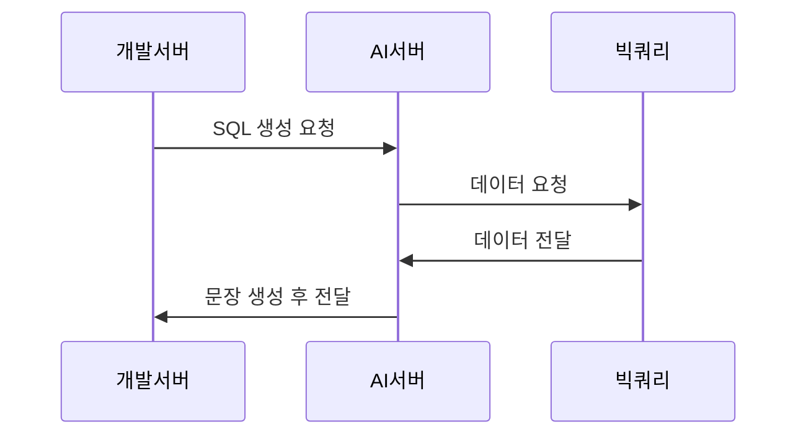
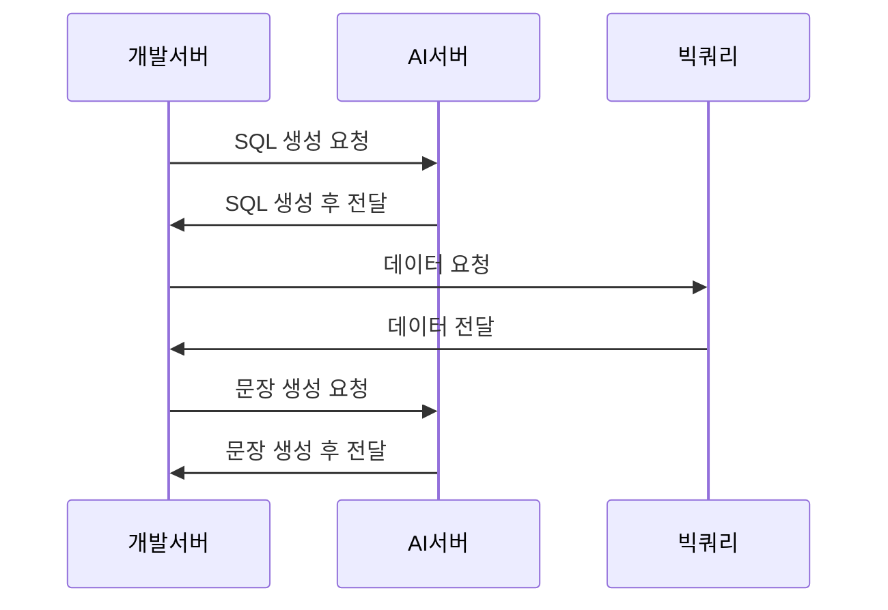

# Before

```mermaid
sequenceDiagram
    participant DevServer as 개발서버
    participant AIServer as AI서버
    participant BigQuery as 빅쿼리

    DevServer->>AIServer: SQL 생성 요청
    AIServer->>BigQuery: 데이터 요청
    BigQuery->>AIServer: 데이터 전달
    AIServer->>DevServer: 문장 생성 후 전달
```

# After

```mermaid
sequenceDiagram
    participant DevServer as 개발서버
    participant AIServer as AI서버
    participant BigQuery as 빅쿼리

    DevServer->>AIServer: SQL 생성 요청
    AIServer->>DevServer: SQL 생성 후 전달
    DevServer->>BigQuery: 데이터 요청
    BigQuery->>DevServer: 데이터 전달
    DevServer->>AIServer: 문장 생성 요청
    AIServer->>DevServer: 문장 생성 후 전달
```

# After 2