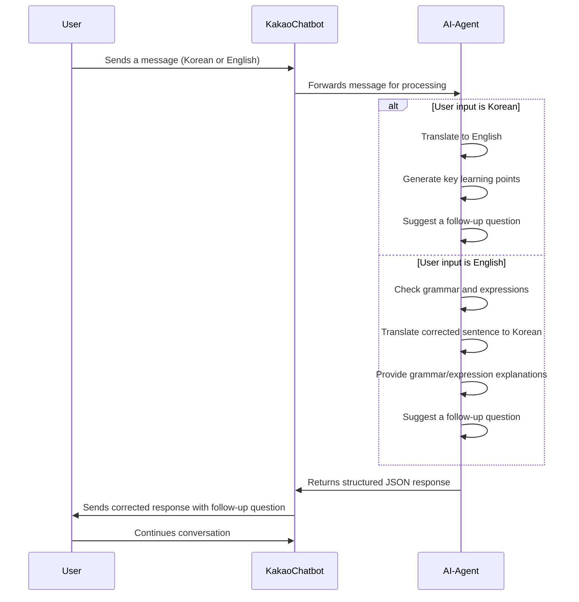

```mermaid
sequenceDiagram
    participant User
    participant KakaoChatbot
    participant AI-Agent

    User->>KakaoChatbot: Sends a message (Korean or English)
    KakaoChatbot->> AI-Agent: Forwards message for processing
    
    alt User input is Korean
        AI-Agent->> AI-Agent: Translate to English
        AI-Agent->> AI-Agent: Generate key learning points
        AI-Agent->> AI-Agent: Suggest a follow-up question
    else User input is English
        AI-Agent->> AI-Agent: Check grammar and expressions
        AI-Agent->> AI-Agent: Translate corrected sentence to Korean
        AI-Agent->> AI-Agent: Provide grammar/expression explanations
        AI-Agent->> AI-Agent: Suggest a follow-up question
    end
    
    AI-Agent->>KakaoChatbot: Returns structured JSON response
    KakaoChatbot->>User: Sends corrected response with follow-up question
    User->>KakaoChatbot: Continues conversation
```
